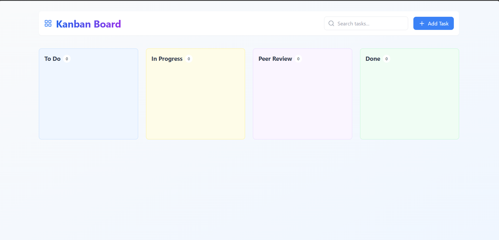
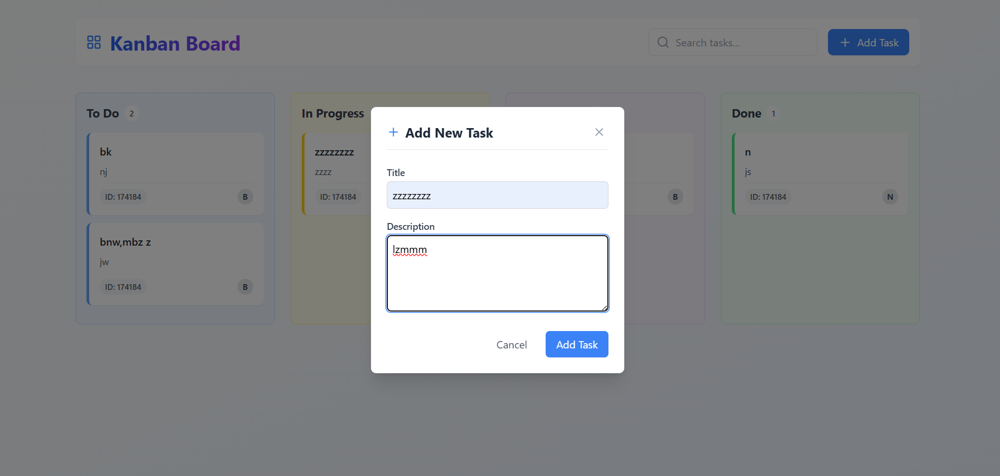
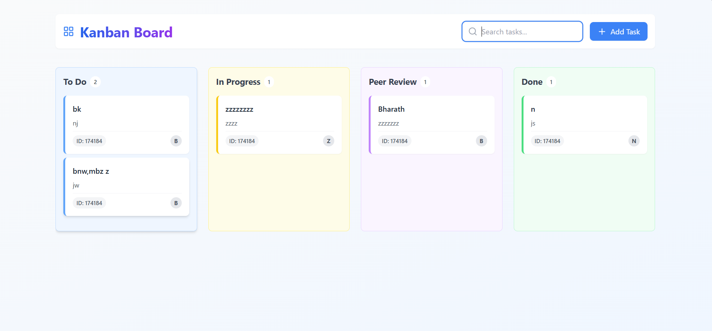

# 📝 Kanban Board

  

### 🚀 Live Demo: [kanban-board-bk.netlify.app](https://kanban-board-bk.netlify.app/)


### 📌 Project Overview
Kanban Board is a task management web app that allows users to organize tasks into different columns such as To Do, In Progress, Peer Review, and Done using drag-and-drop functionality.


## 🎯 Features
✅ Drag & Drop support for smooth task management.

✅ Add, Edit, and Delete Tasks dynamically

✅ Responsive UI with Tailwind CSS

✅ Local Storage Support (Tasks persist even after page reload)

✅ Search Functionality to quickly find tasks

✅ User-Friendly Interface

## 🛠️ Tech Stack
Frontend: React.js, TypeScript, Tailwind CSS

State Management: Redux Toolkit

Drag & Drop: @hello-pangea/dnd

Deployment: Netlify 

## 📂 Folder Structure
```
kanban-board/
│── public/
│── src/
│   ├── components/
│   │   ├── AddTaskModal.tsx
│   │   ├── Column.tsx
│   │   ├── StrictModeDroppable.tsx
│   │   ├── TaskCard.tsx
│   ├── store/
│   │   ├── index.ts
│   │   ├── kabanSlice.ts
│   ├── types/
│   │   ├── index.ts
│   ├── App.tsx
│   ├── index.css
│   ├── Main.tsx
│── package.json
│── README.md
```

## 🛠️ Installation & Setup
```bash
# Clone the repository
git clone https://github.com/i-am-bharathkumar/kanban-board.git

# Navigate to the project folder
cd kanban-board

# Install dependencies
npm install

# Start the development server
npm run dev
```

## 🔍 How to Use

1. View all your tasks organized in columns
2. Create a new task by clicking the "Add Task" button
3. Search for specific tasks using the search bar
4. Drag and drop tasks between columns to update their status
5. Edit or delete tasks by using the options on each task card

## 📸 Screenshots
### **Dashboard View**


### **Drag & Drop Feature**


## 🚀 Deployment
This project is deployed on **Netlify**. You can visit the live site here:  
🔗 [kanban-board-bk.netlify.app](https://kanban-board-bk.netlify.app/)

## 🤝 Contributing
Feel free to fork this repository and contribute improvements.  

## 📝 License
This project is **open-source** and available under the [MIT License](LICENSE).
